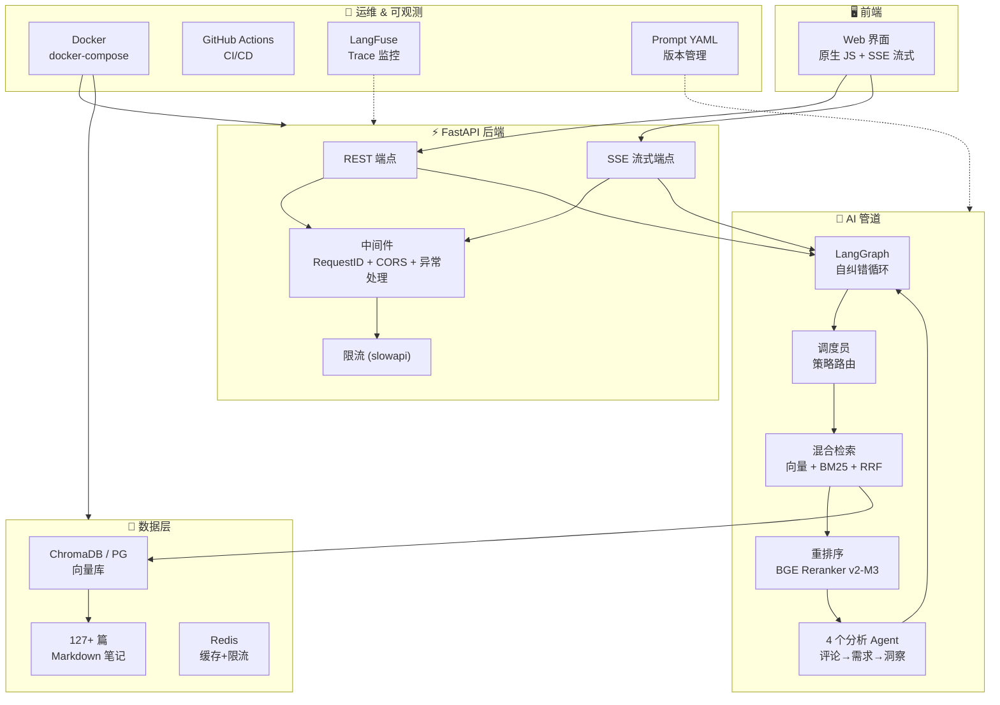

# 🎯 小红书爆款雷达 — AI 选品洞察引擎

<p align="center">
  <b>翻评论 · 找痛点 · 定方向 — 让 AI 从小红书评论区挖出下一个爆款</b>
</p>

<p align="center">
  <a href="#-快速开始"></a>
  <a href="#-docker-部署"></a>
</p>

<p align="center">
  
  
  
  
  
  
  
  
  
  
  
  
</p>

---

## 📖 目录

- [🎯 它能做什么](#-它能做什么)
- [🏗️ 系统架构](#️-系统架构)
- [✨ 核心特性](#-核心特性)
- [⚡ 快速开始](#-快速开始)
- [🐳 Docker 部署](#-docker-部署)
- [📊 RAGAS 质量评估](#-ragas-质量评估)
- [🔌 API 文档](#-api-文档)
- [🔧 技术选型](#-技术选型)
- [📁 项目结构](#-项目结构)
- [🗺️ 路线图](#️-路线图)

---

## 🎯 它能做什么

| 模式 | 你输入 | 它输出 |
|------|--------|--------|
| 📊 **选品洞察** | "健身服" | 结构化市场报告：用户痛点、利润空间、竞争格局、选品建议 |
| 📊 **流式洞察** | "磁吸感应灯" | 逐阶段 + 逐字输出洞察报告，所见即所得 |
| 💬 **智能问答** | "磁吸感应灯哪个品牌好？" | 基于真实笔记的品牌对比，列出优缺点 |
| 💬 **流式问答** | 同上 | 逐 token 打字机效果输出答案 |
| 📐 **质量评估** | 点击"运行评估" | RAGAS 四项指标：精度、召回率、忠实度、相关性 |

### 报告示例

```
━━━━━━━━━━━━━━━━━━━━━━━━━━━━━━
📊 电商选品洞察报告 — 磁吸感应灯
━━━━━━━━━━━━━━━━━━━━━━━━━━━━━━

【市场概况】
品类热度：高 | 分析笔记：42 篇 | 常青款占比：80%

【利润空间评估】
平均售价：¥89 | 成本：¥25 | 定价倍率：3.6x ✅
预估利润率：72%

【用户痛点 TOP 5】
1. 感应距离太短（34%）— "走近才亮，人都到跟前了"
2. 电池续航不足（28%）— "三天两头充电"
3. 粘贴不牢固（18%）— "用几天就掉下来"
4. 充电口老旧（12%）— "还在用 Micro-USB"
5. 亮度不足（8%）— "只能当夜灯用"

【选品综合评分】
┌─────────────────────┬──────┐
│ 利润空间            │  85  │
│ 物流友好            │  78  │
│ 竞争强度            │  62  │
│ 市场需求            │  90  │
├─────────────────────┼──────┤
│ 综合评分             │  79  │  ← A 级
└─────────────────────┴──────┘

💡 "磁吸+分离式"设计是最大空白——做这个方向，有机会。
```

---

## 🏗️ 系统架构



**数据流转：**
```
用户输入 → 混合检索（向量 + BM25 + RRF 融合）
  → CrossEncoder 重排序（相关度 ≥ 0.1 才保留）
  → 评论分析 Agent（提取投诉 + 购买意向）
  → 需求聚合 Agent（聚类 + 打分）
  → 选品洞察 Agent（LLM 生成报告 / 流式逐 token 输出）
  → RAGAS 质量评估（量化指标）
```

---

## ✨ 核心特性

### 🔀 混合检索
- **向量检索**（BGE-M3）：捕捉中文语义相似性
- **BM25 关键词检索**（jieba 分词）：精确匹配品牌名、型号
- **RRF 融合算法**：两种排序结果加权合并
- **CrossEncoder 重排序**（BGE Reranker v2-M3）：比 LLM-as-Judge 快 10 倍

### 🤖 LangGraph 多 Agent 协作
| Agent | 职责 |
|-------|------|
| **Supervisor（调度员）** | 自动分析问题特征，选择最佳检索策略 |
| **Comment Analyzer（评论分析）** | 解析 YAML 格式的评论数据 |
| **Demand Aggregator（需求聚合）** | 聚类痛点、计算热度评分 |
| **Insight Generator（洞察生成）** | 生成结构化电商报告 + 流式输出 |

### ⚡ SSE 流式输出
- `/api/qa/stream`：逐 token 打字机效果
- `/api/insight/stream`：逐阶段（检索→分析→聚合→生成）实时反馈
- 前端 `EventSource` 原生消费，零依赖

### 📐 RAGAS 质量评估
四项指标：上下文精度、召回率、忠实度、答案相关性

### 🔥 按需数据抓取
知识库缺失时自动调用爬虫 → 增量入库 → 重新检索

### 🛡️ 生产级基础设施
- **Docker + docker-compose**：一键部署（API + PostgreSQL + Redis）
- **GitHub Actions CI**：lint → test → build 自动化
- **RequestID 中间件**：每个请求 UUID 追踪
- **全局异常处理**：统一 JSON 错误格式
- **限流保护**（slowapi）：可配置 QPS
- **LangFuse 可观测性**：LLM 调用链 Trace
- **Prompt YAML 管理**：版本控制 + 热重载

---

## ⚡ 快速开始

### 你需要什么
- **Python 3.11+**
- **SiliconFlow API Key**（[免费注册](https://siliconflow.cn)）
- **[uv](https://docs.astral.sh/uv/)** 包管理器

### 三步跑起来

```bash
# 1. 克隆项目
git clone https://github.com/Amazinghorseli/RedNote-Insight.git
cd RedNote-Insight

# 2. 配置 API Key
cp .env.example .env
# 编辑 .env 文件，填入你的 OPENAI_API_KEY

# 3. 安装依赖 + 生成演示数据 + 启动
uv sync
uv run python generate_data.py
uv run uvicorn src.api.main:app --reload --port 8000
```

浏览器打开 **http://localhost:8000**。

---

## 🐳 Docker 部署

```bash
# 1. 配置环境变量
cp .env.example .env
vim .env  # 填入 OPENAI_API_KEY

# 2. 一键启动（含 API + PostgreSQL + Redis）
docker-compose up -d

# 3. 查看日志
docker-compose logs -f api

# 4. 验证
curl http://localhost:8000/api/health

# 5. 停止
docker-compose down
```

**服务端口：**
| 服务 | 端口 | 说明 |
|------|:----:|------|
| API | 8000 | FastAPI 应用 |
| PostgreSQL | 5432 | 向量数据库 |
| Redis | 6379 | 缓存/限流 |

---

## 📊 RAGAS 质量评估

```bash
curl -X POST http://localhost:8000/api/evaluate \
  -H "Content-Type: application/json" \
  -d '{"categories": ["磁吸感应灯", "桌面收纳", "健身"]}'
```

---

## 🔌 API 文档

启动后访问：**http://localhost:8000/docs**（Swagger UI）

| 端点 | 方法 | 说明 |
|------|:----:|------|
| `/api/health` | GET | 健康检查 |
| `/api/stats` | GET | 知识库统计 |
| `/api/qa` | POST | 智能问答 |
| `/api/qa/stream` | POST | 流式问答 (SSE) |
| `/api/insight` | POST | 选品洞察 |
| `/api/insight/stream` | POST | 流式洞察 (SSE) |
| `/api/crawl` | POST | 触发数据抓取 |
| `/api/evaluate` | POST | RAGAS 评估 |

### 流式端点示例

```bash
# QA 流式（逐 token 打字机效果）
curl -N -X POST http://localhost:8000/api/qa/stream \
  -H "Content-Type: application/json" \
  -d '{"question":"磁吸感应灯哪个品牌好"}'

# Insight 流式（逐阶段 + 逐 token）
curl -N -X POST http://localhost:8000/api/insight/stream \
  -H "Content-Type: application/json" \
  -d '{"category":"磁吸感应灯"}'
```

---

## 🔧 技术选型

| 组件 | 选型 | 为什么 |
|------|------|--------|
| 🧠 **大模型** | DeepSeek-V4-Flash | 性价比最高，中文能力强 |
| 🔤 **向量模型** | BAAI/bge-m3 | 多语言 SOTA |
| 📏 **重排序** | BAAI/bge-reranker-v2-m3 | CrossEncoder 打分 |
| 🗄️ **向量库** | ChromaDB / PG+pgvector | 支持嵌入式 + 生产级双模式 |
| 🔗 **编排框架** | LangGraph | 多 Agent 编排 + 流式 |
| 🔍 **关键词检索** | BM25 + jieba | 经典 IR 算法 |
| 🖥️ **后端** | FastAPI | 异步 + 自动 API 文档 |
| 🌊 **流式** | SSE (Server-Sent Events) | 原生支持，零依赖 |
| 🎨 **前端** | 原生 JS + SSE | 零 npm 依赖 |
| 📊 **评估** | RAGAS | 业界标准 |
| 🐳 **部署** | Docker + docker-compose | 一键部署 |
| 🔄 **CI** | GitHub Actions | lint → test → build |
| 📈 **可观测** | structlog + LangFuse | 结构化日志 + LLM Trace |
| 📝 **Prompt 管理** | YAML + PromptLoader | 版本控制 + 热重载 |
| 🛡️ **限流** | slowapi | 可配置 QPS |

---

## 📁 项目结构

```
RedNote-Insight/
├── src/
│   ├── api/
│   │   ├── main.py              # FastAPI 应用组装 + 中间件
│   │   ├── dependencies.py      # FastAPI Depends 依赖注入
│   │   └── routes/
│   │       ├── health.py        # GET /api/health, /api/stats
│   │       ├── qa.py            # POST /api/qa
│   │       ├── qa_stream.py     # POST /api/qa/stream (SSE)
│   │       ├── insight.py       # POST /api/insight
│   │       ├── insight_stream.py # POST /api/insight/stream (SSE)
│   │       ├── crawl.py         # POST /api/crawl
│   │       └── evaluate.py      # POST /api/evaluate
│   ├── core/
│   │   ├── state.py             # AppState 依赖注入容器
│   │   ├── observability.py     # LangFuse 集成
│   │   ├── prompt_loader.py     # Prompt YAML 加载器
│   │   └── __init__.py
│   ├── agents/
│   │   ├── supervisor.py        # 策略路由
│   │   ├── comment_agent.py     # 评论分析
│   │   ├── demand_agent.py      # 需求聚合
│   │   └── insight_agent.py     # 洞察生成
│   ├── prompts/                 # 📝 Prompt YAML 文件
│   │   ├── gen_answer_v1.yaml
│   │   ├── rewrite_query_v1.yaml
│   │   ├── supervisor_v1.yaml
│   │   └── insight_report_v2.yaml
│   ├── graph.py                 # LangGraph 图编排
│   ├── retrievers.py            # 混合检索 + 重排序
│   ├── ingestion.py             # 文档加载 + 向量库
│   ├── evaluation.py            # RAGAS 评估
│   ├── crawler.py               # 爬虫接口
│   ├── config.py                # pydantic-settings 配置
│   └── logger.py                # structlog 日志
├── static/
│   ├── index.html
│   ├── css/style.css
│   └── js/app.js                # SSE 流式前端
├── tests/
│   ├── test_demand_agent.py
│   ├── test_api/                # API 集成测试
│   │   ├── test_health.py
│   │   ├── test_qa.py
│   │   └── test_insight.py
│   └── test_agents/             # Agent 单元测试
│       ├── test_supervisor.py
│       └── test_insight_agent.py
├── data/
│   ├── raw/                     # 笔记原始数据
│   └── chroma_db/               # 向量数据库
├── Dockerfile                   # 多阶段构建
├── docker-compose.yml           # API + PG + Redis
├── .github/workflows/ci.yml     # CI/CD
├── .env.example
├── .dockerignore
├── pyproject.toml
└── README.md
```

---

## 🗺️ 路线图

| 阶段 | 内容 | 状态 |
|------|------|:----:|
| **Phase 1** | RAG 管道 + LangGraph 多 Agent + FastAPI + RAGAS | ✅ |
| **Phase 2** | 真实小红书爬虫 + 异步全链路 + 依赖注入 | ✅ |
| **Phase 3** | SSE 流式 + LangFuse + Prompt YAML + 限流 | ✅ |
| **Phase 4** | PostgreSQL + pgvector 迁移 | 📋 |
| **Phase 5** | 图片/视频内容分析 + 微信小程序 | 📋 |

---

## 📄 开源协议

MIT © 2026 — 个人学习、商业用途均自由使用。

---

<p align="center">
  <sub>为 AI 应用开发者而建。如果对你有帮助，给个 ⭐ Star</sub>
</p>
