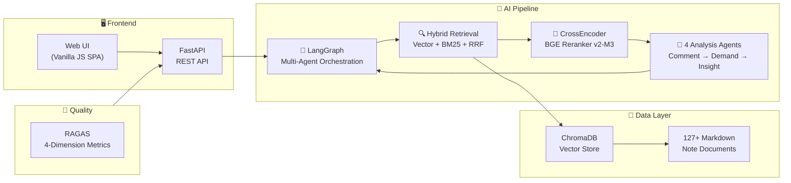

# 🎯 RedNote Insight — AI-Powered E-Commerce Product Research

<p align="center">
  <b>翻评论 · 找痛点 · 定方向 — 用 AI 从小红书评论区挖出下一个爆款</b>
</p>

<p align="center">
  <a href="#-live-demo"></a>
  <a href="#-quick-start"></a>
</p>

<p align="center">
  
  
  
  
  
  
  
  
</p>

---

## 📖 Table of Contents

- [🎯 Live Demo](#-live-demo)
- [🏗️ Architecture](#️-architecture)
- [✨ Key Features](#-key-features)
- [⚡ Quick Start](#-quick-start)
- [📊 RAGAS Evaluation](#-ragas-evaluation)
- [🔧 Tech Stack & Decisions](#-tech-stack--decisions)
- [📁 Project Structure](#-project-structure)
- [🗺️ Roadmap](#️-roadmap)

---

## 🎯 Live Demo

> **https://rednote-insight.streamlit.app** (coming soon)

Or run locally in 3 minutes — see [Quick Start](#-quick-start).

### What It Does

| Mode | Input | Output |
|------|-------|--------|
| 📊 **Insight** | "健身服" | Structured market report: pain points, pricing, competition, profit analysis |
| 💬 **QA** | "磁吸感应灯哪个品牌好?" | Brand comparison with pros/cons from real review data |
| 📐 **Evaluate** | Click "Run" | RAGAS quality metrics (Context Precision, Recall, Faithfulness, Relevancy) |

### Sample Output

```
━━━━━━━━━━━━━━━━━━━━━━━━━━━━━━
📊 电商选品洞察报告 — 磁吸感应灯
━━━━━━━━━━━━━━━━━━━━━━━━━━━━━━

【市场概况】
品类热度：高 | 分析笔记：42 篇 | 常青款占比：80%

【利润空间评估】
平均售价：¥89 | 成本：¥25 | 定价倍率：3.6x ✅
预估利润率：72%

【用户痛点 TOP 5】
1. 感应距离太短（34%）— "走近才亮，人都到跟前了"
2. 电池续航不足（28%）— "三天两头充电"
3. 粘贴不牢固（18%）— "用几天就掉下来"
4. 充电口老旧（12%）— "还在用 Micro-USB"
5. 亮度不足（8%）— "只能当夜灯用"

【选品综合评分】
┌─────────────────────┬──────┐
│ 利润空间            │  85  │
│ 物流友好            │  78  │
│ 竞争强度            │  62  │
│ 市场需求            │  90  │
├─────────────────────┼──────┤
│ 综合评分             │  79  │  ← A 级
└─────────────────────┴──────┘

💡 "磁吸+分离式"设计是最大空白——做这个方向，有机会。
```

---

## 🏗️ Architecture



**Pipeline Flow:**
```
User Query → Hybrid Search (Vector + BM25 + RRF)
  → CrossEncoder Rerank (score ≥ 0.1)
  → Comment Analysis Agent (extract complaints & intents)
  → Demand Aggregator (cluster & score)
  → Insight Generator (LLM report)
  → RAGAS Evaluation (quality metrics)
```

---

## ✨ Key Features

### 🔀 Hybrid Retrieval — The Core
- **Vector Search** (BGE-M3): Captures semantic similarity across Chinese text
- **BM25 Keyword Search**: Exact-match for brand names & product terms
- **RRF Fusion** (Reciprocal Rank Fusion): Weighted combination of both rankings
- **CrossEncoder Reranker** (BGE Reranker v2-M3): Document-level relevance scoring — faster & cheaper than LLM-as-Judge

### 🤖 LangGraph Multi-Agent System
| Agent | Role |
|-------|------|
| **Supervisor** | Auto-selects retrieval strategy (vector / keyword / hybrid) |
| **Comment Analyzer** | Extracts complaints & purchase intent from YAML-structured review data |
| **Demand Aggregator** | Clusters pain points, calculates demand scores, identifies comparison patterns |
| **Insight Generator** | Produces structured e-commerce reports with profit/logistics/competition scoring |

Self-correcting loop: If retrieved documents are irrelevant → auto-rewrite query → retry (max 2x).

### 📐 RAGAS Quality Evaluation
Automated pipeline evaluation with 4 metrics:
- **Context Precision** — Are retrieved docs relevant?
- **Context Recall** — Are all relevant docs retrieved?
- **Faithfulness** — Is the answer grounded in retrieved context?
- **Answer Relevancy** — Does the answer address the question?

### 🔥 On-Demand Data Generation
When a category isn't in the knowledge base:
1. LLM recommends trending brands for that category
2. Generates realistic XHS-style notes with structured comment data
3. Incrementally ingested into ChromaDB + BM25 index
4. Re-runs the insight pipeline

### 📥 Real Data Import
```bash
uv run python import_data.py --input my_data.csv       # CSV
uv run python import_data.py --input my_data.xlsx       # Excel
uv run python import_data.py --input my_data.csv --enrich  # + LLM enrichment
```

---

## ⚡ Quick Start

### Prerequisites
- **Python 3.10+**
- **SiliconFlow API Key** ([free registration](https://siliconflow.cn)) — or any OpenAI-compatible provider
- **[uv](https://docs.astral.sh/uv/)** package manager

### 3 Steps to Run

```bash
# 1. Clone & setup
git clone https://github.com/YOUR_USERNAME/RedNote-Insight.git
cd RedNote-Insight

# 2. Configure API key
cp .env.example .env
# Edit .env → paste your OPENAI_API_KEY

# 3. Install & generate demo data & launch
uv sync
uv run python generate_data.py
uv run uvicorn api:app --reload --port 8000
```

Open **http://localhost:8000** — you're ready to go.

> 💡 **Want one-click?** Run `.\run.bat` (Windows) or `bash run.sh` (Mac/Linux).

---

## 📊 RAGAS Evaluation

Run quality assessment at any time:

```bash
curl -X POST http://localhost:8000/api/evaluate \
  -H "Content-Type: application/json" \
  -d '{"categories": ["磁吸感应灯", "桌面收纳", "健身"]}'
```

Response:
```json
{
  "overall_score": 78.5,
  "grade": "A",
  "ragas_scores": {
    "context_precision": 82.3,
    "context_recall": 75.1,
    "faithfulness": 80.2,
    "answer_relevancy": 76.4
  }
}
```

---

## 🔧 Tech Stack & Decisions

| Component | Choice | Why |
|-----------|--------|-----|
| 🧠 **LLM** | DeepSeek-V4-Flash | Best cost-performance for Chinese text |
| 🔤 **Embedding** | BAAI/bge-m3 | Multilingual SOTA, excellent Chinese semantics |
| 📏 **Reranker** | BAAI/bge-reranker-v2-m3 | CrossEncoder scoring, 10x faster than LLM-Judge |
| 🗄️ **Vector DB** | ChromaDB (embedded) | Zero-config, no external service needed |
| 🔗 **Orchestration** | LangGraph | Directed graph Multi-Agent with self-correcting loops |
| 🔍 **Keyword Search** | BM25 + jieba | Classic IR, complementary to vector search |
| 🖥️ **Backend** | FastAPI | Modern async Python, auto-generated OpenAPI docs |
| 🎨 **Frontend** | Vanilla JS SPA | Zero npm dependencies, served by FastAPI |
| 📊 **Evaluation** | RAGAS | Industry-standard RAG quality metrics |
| 🚀 **Deploy** | Streamlit Cloud / Railway | Free tier, instant deploy |

**Design Principle: Zero external service dependencies.** No Docker, PostgreSQL, or Redis — everything runs in one Python process.

---

## 📁 Project Structure

```
RedNote-Insight/
├── api.py                    # 🖥️  FastAPI backend (REST + SPA hosting)
├── app.py                    # 📱  Streamlit frontend (quick local test)
├── generate_data.py          # 📝  Demo data generator
├── import_data.py            # 📥  CSV/Excel data import tool
├── pyproject.toml            # ⚙️  Dependencies & project config
├── .env.example              # 🔑  Configuration template
├── run.bat / run.sh          # 🚀  One-click launchers
│
├── src/
│   ├── config.py             # Unified config (LLM / Embedding / Reranker)
│   ├── evaluation.py         # 📐 RAGAS evaluation module
│   ├── crawler.py            # 🕷️  Crawler interface (Phase 2: real XHS crawler)
│   ├── ingestion.py          # Document loader + vector store + incremental ingest
│   ├── retrievers.py         # HybridRetriever (Vector+BM25+RRF) + APIReranker
│   ├── rag_pipeline.py       # Base RAG QA pipeline
│   ├── graph.py              # LangGraph orchestration (self-correcting loop)
│   ├── mcp_tools.py          # MCP server (for AI agent integration)
│   └── agents/
│       ├── supervisor.py     # Strategy router (auto / vector / keyword / hybrid)
│       ├── comment_agent.py  # Comment analysis (YAML review data)
│       ├── demand_agent.py   # Demand aggregation (clustering + scoring)
│       └── insight_agent.py  # Insight report generator (LLM + fallback)
│
├── static/                    # 🎨 Frontend SPA
│   ├── index.html
│   ├── css/style.css
│   └── js/app.js
│
└── data/
    ├── raw/                   # 📂 Raw note data (.md with YAML + review analysis)
    └── chroma_db/             # 🔇 Vector DB (auto-built, git-ignored)
```

---

## 🗺️ Roadmap

| Phase | Content | Status |
|-------|---------|:------:|
| **Phase 1** | RAG pipeline + LangGraph Multi-Agent + FastAPI + RAGAS | ✅ Done |
| **Phase 2** | Real XHS crawler (Playwright/DrissionPage) — replace simulated data | 🔜 Next |
| **Phase 3** | Image/video content analysis + Trend prediction | 📋 Planned |
| **Phase 4** | WeChat Mini-Program + User accounts + SaaS deployment | 📋 Planned |

---

## 📄 License

MIT © 2026 — Free for personal, educational, and commercial use.

---

<p align="center">
  <sub>Built with ❤️ for AI application developers. If this helps you, give it a ⭐</sub>
</p>
