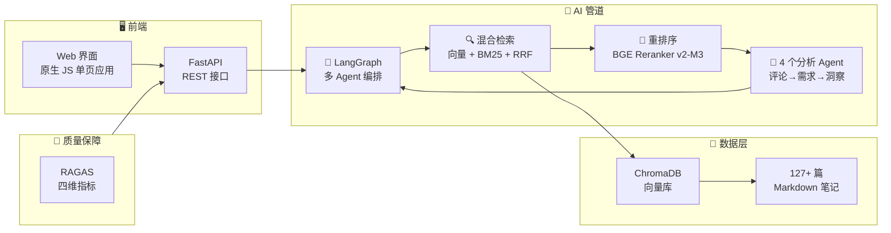

# 🎯 小红书爆款雷达 — AI 选品洞察引擎

<p align="center">
  <b>翻评论 · 找痛点 · 定方向 — 让 AI 从小红书评论区挖出下一个爆款</b>
</p>

<p align="center">
  <a href="#-在线体验"></a>
  <a href="#-快速开始"></a>
</p>

<p align="center">
  
  
  
  
  
  
  
  
</p>

---

## 📖 目录

- [🎯 它能做什么](#-它能做什么)
- [🏗️ 系统架构](#️-系统架构)
- [✨ 核心特性](#-核心特性)
- [⚡ 快速开始](#-快速开始)
- [📊 RAGAS 质量评估](#-ragas-质量评估)
- [🔧 技术选型](#-技术选型)
- [📁 项目结构](#-项目结构)
- [🗺️ 路线图](#️-路线图)

---

## 🎯 在线体验

> **https://rednote-insight.streamlit.app**（部署中）

也可以本地 3 分钟跑起来，见下方[快速开始](#-快速开始)。

### 功能一览

| 模式 | 你输入 | 它输出 |
|------|--------|--------|
| 📊 **选品洞察** | "健身服" | 结构化市场报告：用户痛点、利润空间、竞争格局、选品建议 |
| 💬 **智能问答** | "磁吸感应灯哪个品牌好？" | 基于真实笔记的品牌对比，列出优缺点 |
| 📐 **质量评估** | 点击"运行评估" | RAGAS 四项指标：精度、召回率、忠实度、相关性 |

### 报告示例

```
━━━━━━━━━━━━━━━━━━━━━━━━━━━━━━
📊 电商选品洞察报告 — 磁吸感应灯
━━━━━━━━━━━━━━━━━━━━━━━━━━━━━━

【市场概况】
品类热度：高 | 分析笔记：42 篇 | 常青款占比：80%

【利润空间评估】
平均售价：¥89 | 成本：¥25 | 定价倍率：3.6x ✅
预估利润率：72%

【用户痛点 TOP 5】
1. 感应距离太短（34%）— "走近才亮，人都到跟前了"
2. 电池续航不足（28%）— "三天两头充电"
3. 粘贴不牢固（18%）— "用几天就掉下来"
4. 充电口老旧（12%）— "还在用 Micro-USB"
5. 亮度不足（8%）— "只能当夜灯用"

【选品综合评分】
┌─────────────────────┬──────┐
│ 利润空间            │  85  │
│ 物流友好            │  78  │
│ 竞争强度            │  62  │
│ 市场需求            │  90  │
├─────────────────────┼──────┤
│ 综合评分             │  79  │  ← A 级
└─────────────────────┴──────┘

💡 "磁吸+分离式"设计是最大空白——做这个方向，有机会。
```

---

## 🏗️ 系统架构



**数据流转：**
```
用户输入 → 混合检索（向量 + BM25 + RRF 融合）
  → CrossEncoder 重排序（相关度 ≥ 0.1 才保留）
  → 评论分析 Agent（提取投诉 + 购买意向）
  → 需求聚合 Agent（聚类 + 打分）
  → 选品洞察 Agent（LLM 生成报告）
  → RAGAS 质量评估（量化指标）
```

---

## ✨ 核心特性

### 🔀 混合检索 — 核心能力
- **向量检索**（BGE-M3）：捕捉中文语义相似性，同义词、口语化表达都能命中
- **BM25 关键词检索**（jieba 分词）：精确匹配品牌名、型号、专有名词
- **RRF 融合算法**：两种排序结果加权合并，互补长短
- **CrossEncoder 重排序**（BGE Reranker v2-M3）：逐条文档打分，比 LLM-as-Judge 快 10 倍、便宜 100 倍

### 🤖 LangGraph 多 Agent 协作
| Agent | 职责 |
|-------|------|
| **Supervisor（调度员）** | 自动分析问题特征，选择最佳检索策略（向量/关键词/混合） |
| **Comment Analyzer（评论分析）** | 解析 YAML 格式的评论数据，提取用户投诉和购买意向 |
| **Demand Aggregator（需求聚合）** | 聚类痛点、计算热度评分、识别品牌对比模式 |
| **Insight Generator（洞察生成）** | 生成结构化电商报告：利润、物流、竞争、需求四维评分 |

**自纠错循环**：检索结果不相关 → 自动重写查询 → 重新检索（最多重试 2 次）。

### 📐 RAGAS 质量评估
自动化管道评估，四项指标：
- **上下文精度**：检索到的文档是否与问题相关
- **上下文召回率**：相关文档是否被检索到
- **忠实度**：生成的答案是否基于检索到的上下文
- **答案相关性**：答案是否真正回答了问题

### 🔥 按需数据生成
当知识库没有某个品类时：
1. LLM 推荐该品类在小红书的爆款品牌
2. 自动生成仿真实笔记（含 YAML 结构化评论数据）
3. 增量入库到 ChromaDB + BM25 索引
4. 重新运行洞察管道

### 📥 真实数据导入
```bash
uv run python import_data.py --input my_data.csv           # CSV 导入
uv run python import_data.py --input my_data.xlsx          # Excel 导入
uv run python import_data.py --input my_data.csv --enrich  # LLM 自动丰富评论分析
```

---

## ⚡ 快速开始

### 你需要什么
- **Python 3.10+**
- **SiliconFlow API Key**（[免费注册](https://siliconflow.cn)，新用户有额度）— 或其他兼容 OpenAI 格式的 API
- **[uv](https://docs.astral.sh/uv/)** 包管理器

### 三步跑起来

```bash
# 1. 克隆项目
git clone https://github.com/Amazinghorseli/RedNote-Insight.git
cd RedNote-Insight

# 2. 配置 API Key
cp .env.example .env
# 编辑 .env 文件，填入你的 OPENAI_API_KEY

# 3. 安装依赖 + 生成演示数据 + 启动
uv sync
uv run python generate_data.py
uv run uvicorn api:app --reload --port 8000
```

浏览器打开 **http://localhost:8000**，就能用了。

> 💡 **一键启动**：Windows 双击 `run.bat`，Mac/Linux 运行 `bash run.sh`。

---

## 📊 RAGAS 质量评估

随时检查管道的检索和生成质量：

```bash
curl -X POST http://localhost:8000/api/evaluate \
  -H "Content-Type: application/json" \
  -d '{"categories": ["磁吸感应灯", "桌面收纳", "健身"]}'
```

返回结果：
```json
{
  "overall_score": 78.5,
  "grade": "A",
  "ragas_scores": {
    "context_precision": 82.3,
    "context_recall": 75.1,
    "faithfulness": 80.2,
    "answer_relevancy": 76.4
  }
}
```

---

## 🔧 技术选型

| 组件 | 选型 | 为什么 |
|------|------|--------|
| 🧠 **大模型** | DeepSeek-V4-Flash | 性价比最高，中文能力强，单次调用约 ¥0.002 |
| 🔤 **向量模型** | BAAI/bge-m3 | 多语言 SOTA，中文语义捕捉出色 |
| 📏 **重排序** | BAAI/bge-reranker-v2-m3 | CrossEncoder 打分，比 LLM-Judge 快 10 倍 |
| 🗄️ **向量库** | ChromaDB（嵌入式） | 零配置，不需要独立数据库服务 |
| 🔗 **编排框架** | LangGraph | 有向图多 Agent 编排，支持循环路由 |
| 🔍 **关键词检索** | BM25 + jieba | 经典 IR 算法，与向量检索互补 |
| 🖥️ **后端** | FastAPI | 异步 Python 框架，自动生成 API 文档 |
| 🎨 **前端** | 原生 JS 单页应用 | 零 npm 依赖，由 FastAPI 直接托管 |
| 📊 **评估** | RAGAS | 业界标准 RAG 质量评估框架 |
| 🚀 **部署** | Streamlit Cloud | 免费部署，一键上线 |

**核心设计原则：零外部依赖。** 不需要 Docker、PostgreSQL、Redis——一个 Python 进程跑全部。

---

## 📁 项目结构

```
RedNote-Insight/
├── api.py                    # 🖥️  FastAPI 后端（REST API + 前端托管）
├── app.py                    # 📱  Streamlit 界面（快速本地测试）
├── generate_data.py          # 📝  演示数据生成器
├── import_data.py            # 📥  CSV/Excel 真实数据导入
├── pyproject.toml            # ⚙️  依赖与项目配置
├── .env.example              # 🔑  环境变量模板
├── run.bat / run.sh          # 🚀  一键启动脚本
│
├── src/
│   ├── config.py             # 统一配置（LLM / Embedding / Reranker）
│   ├── evaluation.py         # 📐 RAGAS 评估模块
│   ├── crawler.py            # 🕷️  爬虫接口（Phase 2：接入真实数据）
│   ├── ingestion.py          # 文档加载 + 向量库构建 + 增量入库
│   ├── retrievers.py         # HybridRetriever（向量+BM25+RRF）+ 重排序
│   ├── rag_pipeline.py       # 基础 RAG 问答管道
│   ├── graph.py              # LangGraph 图编排（自纠错循环）
│   ├── mcp_tools.py          # MCP 服务（支持 AI Agent 调用）
│   └── agents/
│       ├── supervisor.py     # 策略路由（自动/向量/关键词/混合）
│       ├── comment_agent.py  # 评论分析（YAML 结构化评论）
│       ├── demand_agent.py   # 需求聚合（聚类 + 打分）
│       └── insight_agent.py  # 选品洞察（LLM 报告 + 模板兜底）
│
├── static/                    # 🎨 前端单页应用
│   ├── index.html
│   ├── css/style.css
│   └── js/app.js
│
└── data/
    ├── raw/                   # 📂 笔记原始数据（.md + YAML + 评论分析）
    └── chroma_db/             # 🔇 向量数据库（自动构建，不入 git）
```

---

## 🗺️ 路线图

| 阶段 | 内容 | 状态 |
|------|------|:----:|
| **Phase 1** | RAG 管道 + LangGraph 多 Agent + FastAPI + RAGAS 评估 | ✅ 已完成 |
| **Phase 2** | 真实小红书爬虫（Playwright/DrissionPage）— 替换模拟数据 | 🔜 下一步 |
| **Phase 3** | 图片/视频内容分析 + 趋势预测 | 📋 计划中 |
| **Phase 4** | 微信小程序 + 用户系统 + SaaS 商业化 | 📋 计划中 |

---

## 📄 开源协议

MIT © 2026 — 个人学习、商业用途均自由使用。

---

<p align="center">
  <sub>为 AI 应用开发者而建。如果对你有帮助，给个 ⭐ Star</sub>
</p>
