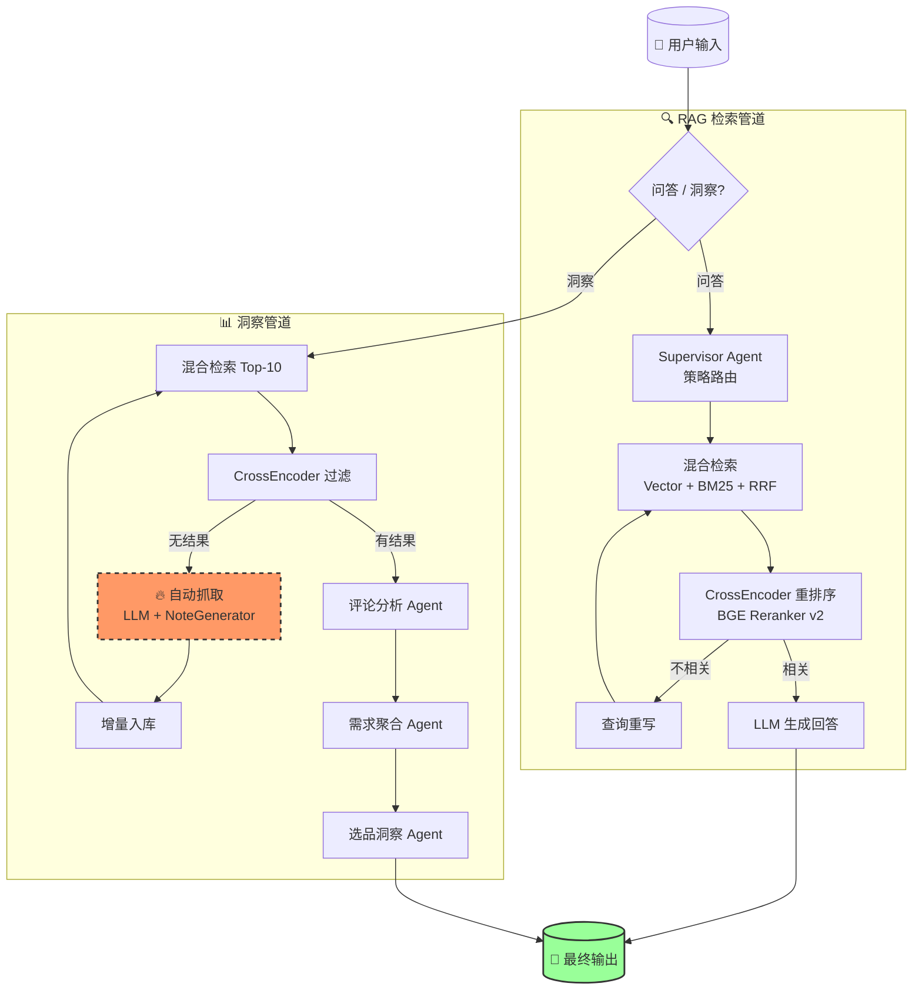

# 🔍 小红书评论区需求挖掘引擎

**从评论区自动提取未被满足的用户需求，赋能选品决策。**

<p align="center">
  
  
  
  
  
  
  
</p>

<p align="center">
  <b>⚠️ 知识库里没有「健身服」？没关系——现场生成，即时分析。</b>
</p>

---

## 📖 目录

- [它能做什么](#-它能做什么)
- [为什么你需要这个](#-为什么你需要这个)
- [架构图](#-架构图)
- [核心特性](#-核心特性)
- [快速开始](#-快速开始)
- [效果预览](#-效果预览)
- [项目结构](#-项目结构)
- [技术栈](#-技术栈)
- [使用指南](#-使用指南)
- [配置说明](#-配置说明)
- [常见问题](#-常见问题)
- [路线图](#-路线图)
- [License](#-license)

---

## 🎯 它能做什么

| 场景 | 说明 |
|------|------|
| 💬 **智能问答** | 基于小红书笔记库，回答产品相关问题（如"磁吸感应灯哪个品牌好"） |
| 📊 **选品洞察** | 输入品类名称，自动分析评论区数据，输出结构化市场报告 |
| 🔥 **自动抓取** | 知识库没有的品类？自动现场生成笔记，即时入库分析 |
| 📥 **数据导入** | 支持 CSV/Excel 一键导入你的真实笔记数据 |

---

## 💡 为什么你需要这个

做电商选品的人都知道：**真正的需求藏在评论区里**。

但小红书上几百条评论、几十篇笔记，人工翻一遍要花半天。而且：
- 评论里的"尺寸太小了""续航不够""胶贴不稳"散落在各处，难以汇总
- 你有真实笔记数据，但没有工具做分析
- 你想调研一个新品类，但手头没有数据

这个项目解决的就是这三层问题——**检索 → 聚合 → 洞察**，一键出报告。

---

## 🏗️ 架构图



---

## ✨ 核心特性

### 🔀 Hybrid Retrieval — 混合检索
- **向量检索**（BGE-M3 Embedding）：捕捉语义相似性
- **BM25 关键词检索**：精确匹配专有名词和品牌名
- **RRF 融合**（Reciprocal Rank Fusion）：取两者排序结果加权融合，互补长短

### 🎯 CrossEncoder 重排序
- 用专门的 **BGE Reranker v2 M3** 模型对检索结果逐条打分
- 比 LLM-as-Judge 更准、更快、更便宜
- 低于阈值（0.1）的文档自动丢弃，保证回答不跑偏

### 🤖 LangGraph Multi-Agent 编排
- **Supervisor Agent** — 自动分析问题特征，选择最佳检索策略
- **Self-Correcting Loop** — 检索结果不相关时自动重写查询，最多重试 2 次
- **Insight Agent Chain** — 评论分析 → 需求聚合 → 选品洞察，三阶段流水线

### 🔥 查询时自动抓取（v0.3 新功能）
这是最关键的特性——**不绑定固定品类**，任何品类都能查：
```
用户搜 "健身服" → 知识库无数据
  → LLM 推荐品牌（Nike, Lululemon, 粒子狂热...）
  → 自动生成 8 篇该品类笔记（含 YAML 评论分析数据）
  → 增量入库到 ChromaDB + BM25
  → 重新检索 → 生成真正的市场洞察报告
```

### 📥 真实数据导入
```bash
# CSV 导入
python import_data.py --input my_data.csv

# Excel 导入
python import_data.py --input my_data.xlsx --sheet Sheet1

# 导入后用 LLM 丰富评论分析
python import_data.py --input my_data.csv --enrich
```

---

## 🚀 快速开始

### 你需要什么

- **Python 3.10+**
- **SiliconFlow API Key**（或其他兼容 OpenAI 格式的 API）— [免费注册](https://siliconflow.cn)
- [uv](https://docs.astral.sh/uv/) 包管理器（推荐，替代 pip）

### 4 步跑起来

```bash
# 1. 克隆项目
git clone https://github.com/your-username/xiaohongshu-insight.git
cd xiaohongshu-insight

# 2. 配置 API Key
cp .env.example .env
# 编辑 .env → 填入你的 OPENAI_API_KEY

# 3. 安装依赖 + 生成演示数据
uv sync
uv run python generate_data.py

# 4. 启动应用
uv run streamlit run app.py
```

浏览器打开 **http://localhost:8501**，就可以用了。

> **用什么 API 便宜又好用？** 推荐 [SiliconFlow](https://siliconflow.cn)，免费额度够用很久。DeepSeek-V4-Flash + BGE-M3 + BGE Reranker 三个模型同时调，一条链路的成本约 ¥0.002。

---

## 📊 效果预览

### 问答模式

```
用户：磁吸感应灯哪个品牌好？

助手：
根据小红书笔记分析，磁吸感应灯的热门选择包括：

1. 几光（EZVALO）— 被提及最多，用户评价集中在"感应灵敏、安装方便"
   ✅ 人体感应+光感双模，免布线安装
   ❌ 价格偏高（约100-200元）

2. 松下 — 品质口碑好，但款式较少
   ✅ 做工精细，感应距离远
   ❌ 价格区间窄，选择少

3. 名创优品 — 性价比之选
   ✅ 价格低（20-50元），设计可爱
   ❌ 感应距离短，电池续航一般

建议：预算充足选几光，追求性价比可考虑名创优品。
```

### 洞察模式

```
品类：磁吸感应灯

📋 评论区需求分析报告
━━━━━━━━━━━━━━━━━━━━━━

🔍 用户痛点 Top 3
1. 感应距离太短（提及率 34%）— "走近才亮，人都到跟前了"
2. 电池续航不足（提及率 28%）— "三天两头充电"
3. 粘贴不牢固（提及率 18%）— "用几天就掉下来"

💡 未被满足的需求
• Type-C 充电（非 Micro-USB）
• 磁吸分离式设计（可取下当手电筒）
• 更长的感应距离（>3米）
• 充电底座而非粘贴式安装

📈 市场机会
"磁吸+分离式"设计是当前最大缺口。竞品集中在"便宜但功能单一"区间，
中高端"品质+设计感"产品有溢价空间。

📥 本次查询为「磁吸感应灯」实时生成了 8 篇新笔记
```

---

## 📁 项目结构

```
xiaohongshu-insight/
│
├── app.py                    # 🖥️  Streamlit 主入口（问答 + 洞察双模式）
├── generate_data.py          # 📝  模拟笔记数据生成器（离线用）
├── import_data.py            # 📥  CSV/Excel 真实数据导入工具
├── pyproject.toml            # ⚙️  项目配置与依赖管理
├── .env.example              # 🔑  环境变量模板（复制为 .env 后填入 API Key）
├── LICENSE                   # 📄  MIT 开源协议
│
├── src/
│   ├── config.py             # 统一配置管理（LLM / Embedding / Reranker 参数）
│   ├── ingestion.py          # 文档加载 + 向量库创建 + 增量入库
│   ├── retrievers.py         # HybridRetriever（Vector+BM25+RRF）+ APIReranker
│   ├── rag_pipeline.py       # 基础 RAG 问答管道
│   ├── graph.py              # LangGraph 图编排（自纠错循环 + 条件路由）
│   ├── fetcher.py            # 🔥 查询时自动抓取（v0.3 新功能）
│   └── agents/
│       ├── supervisor.py     # 策略路由 Agent（auto / vector / keyword / hybrid）
│       ├── comment_agent.py  # 评论分析 Agent（解析 YAML 格式的评论数据）
│       ├── demand_agent.py   # 需求聚合 Agent（聚类用户痛点 + 需求信号）
│       └── insight_agent.py  # 选品洞察 Agent（LLM 生成结构化报告）
│
└── data/
    ├── raw/                  # 📂 笔记原始数据（.md 文件，含 YAML + 评论分析）
    │   └── .gitkeep
    └── chroma_db/            # 🔇 向量数据库（自动构建，不入 git）
```

---

## 🧩 技术栈

| 组件 | 选型 | 为什么 |
|------|------|--------|
| 🧠 **LLM** | DeepSeek-V4-Flash (via SiliconFlow) | 性价比最高的推理模型，¥0.002/次 |
| 🔤 **Embedding** | BAAI/bge-m3 | 多语言 SOTA，中文语义捕捉优秀 |
| 📏 **Reranker** | BAAI/bge-reranker-v2-m3 | CrossEncoder 打分，比 LLM-Judge 快 10x |
| 🗄️ **向量库** | ChromaDB（嵌入式模式） | 零配置，不需要独立数据库服务 |
| 🔗 **编排** | LangGraph | 有向图编排 Multi-Agent，支持循环路由 |
| 🔍 **检索** | BM25 (rank-bm25) + RRF | 经典关键词检索 + 融合排序 |
| 🇨🇳 **分词** | jieba | 中文分词，BM25 索引必需 |
| 🖥️ **应用** | Streamlit | 纯 Python，一键启动，无需前后端分离 |
| 📥 **导入** | pandas + openpyxl | CSV/Excel 读取 |

**核心设计原则：零外部依赖服务。** 没有 Docker、没有 PostgreSQL、没有 Redis——全部跑在一个 Python 进程里。

---

## 📖 使用指南

### 1. 生成演示数据

```bash
# 默认：6 品类 42 篇笔记
uv run python generate_data.py

# 自定义品类
uv run python generate_data.py \
  --category "智能马桶" \
  --brands "恒洁,九牧,TOTO" \
  --count 30

# 固定随机种子（结果可复现）
uv run python generate_data.py --category "台灯" --brands "欧普,松下" --seed 42
```

默认 6 个品类：磁吸感应灯（8篇）、桌面收纳（7篇）、寝室改造（7篇）、香薰（6篇）、装饰品（7篇）、收纳盒（7篇）。

### 2. 导入你自己的数据

```bash
# 查看格式
uv run python import_data.py --help

# 导入 CSV
uv run python import_data.py --input my_data.csv

# 导入 Excel
uv run python import_data.py --input my_data.xlsx --sheet Sheet1

# 导入 + LLM 自动丰富评论分析
uv run python import_data.py --input my_data.csv --enrich
```

CSV 格式：`title,content,brand,likes,date,tags,comments,author`，只有 `title` 和 `content` 必填。

### 3. 问答模式

侧边栏切换到「问答模式」，试试这些：
- "磁吸感应灯哪个品牌好？"
- "有没有便宜又耐用的收纳盒推荐？"
- "寝室改造需要注意什么？"

可手动选择检索策略（auto / vector / keyword / hybrid），默认 auto 由 Supervisor Agent 自动判断。

### 4. 洞察模式

侧边栏切换到「洞察模式」，输入任何品类：
- "磁吸感应灯"、"桌面收纳"、"寝室改造"
- "健身服" ← 知识库里没有？自动帮你生成 8 篇再分析

系统会输出一份 **结构化市场洞察报告**，包含用户痛点 Top 3、需求信号、竞品格局、选品建议、机会打分。

---

## 🔧 配置说明

`.env` 文件中的配置项（复制自 `.env.example`）：

```bash
# ===== LLM 配置 =====
OPENAI_BASE_URL=https://api.siliconflow.cn/v1   # API 地址（支持任何 OpenAI 兼容服务）
OPENAI_API_KEY=sk-your-key-here                  # API 密钥
LLM_MODEL=deepseek-ai/DeepSeek-V4-Flash          # 主推理模型

# ===== Embedding =====
EMBEDDING_MODEL=BAAI/bge-m3                     # 文本向量化模型

# ===== Reranker =====
RERANKER_MODEL=BAAI/bge-reranker-v2-m3          # CrossEncoder 重排序模型
```

**支持的 API 提供商：** SiliconFlow、阿里云百炼、火山引擎、DeepSeek 官方等任何兼容 OpenAI `/v1/chat/completions` 和 `/v1/embeddings` 的服务。

---

## ❓ 常见问题

<details>
<summary><b>为什么不用 Qdrant / Milvus？</b></summary>
ChromaDB 嵌入式模式零配置，适合单机使用。项目定位是个人选品分析工具，不需分布式向量库。如果你需要生产级部署，可以替换为 Qdrant——只需改 `ingestion.py` 中 3 行代码。
</details>

<details>
<summary><b>自动抓取生成的数据准确吗？</b></summary>
自动生成的内容基于 LLM 对市场的理解 + 模板化评论数据，用于快速验证品类可行性。对于真实商业决策，建议用 <code>import_data.py</code> 导入你自己的笔记数据。
</details>

<details>
<summary><b>不用 SiliconFlow，用 OpenAI 官方可以吗？</b></summary>
可以。把 <code>OPENAI_BASE_URL</code> 改为 <code>https://api.openai.com/v1</code>，模型名改为 <code>gpt-4o</code> 即可。注意 OpenAI 没有 BGE Reranker API，需要本地跑或换其他 reranker 服务。
</details>

<details>
<summary><b>怎么增加更多品类？</b></summary>
两种方式：① 在洞察模式直接搜新品类（自动触发抓取）；② 用 <code>generate_data.py --category</code> 提前生成。
</details>

<details>
<summary><b>Windows 上能跑吗？</b></summary>
能。本项目的开发和测试环境就是 Windows 11 + Python 3.11。
</details>

---

## 🗺️ 路线图

| Phase | 内容 | 状态 |
|-------|------|:----:|
| **Phase 1** | 项目重构 + 基础 RAG（文档加载、向量库、问答管道） | ✅ |
| **Phase 2** | 评论区需求挖掘（Comment / Demand / Insight Agents） | ✅ |
| **Phase 3** | 选品看板（问答+洞察双模式、Streamlit UI、数据导入工具） | ✅ |
| **Phase 4** | 查询时自动抓取（LLM + NoteGenerator，任何品类都能查） | ✅ |
| **Phase 5** | 真实网页抓取（接小红书搜索 API / 浏览器自动化） | 🔜 |
| **Phase 6** | 意图识别路由 / MCP 工具调用 / 知识图谱增强 | 🔜 |

---

## 📄 License

MIT © 2026 — 使用、修改、商用均自由。

---

<p align="center">
  <sub>如果这个项目帮到了你，请给个 ⭐ Star 支持一下</sub>
</p>
